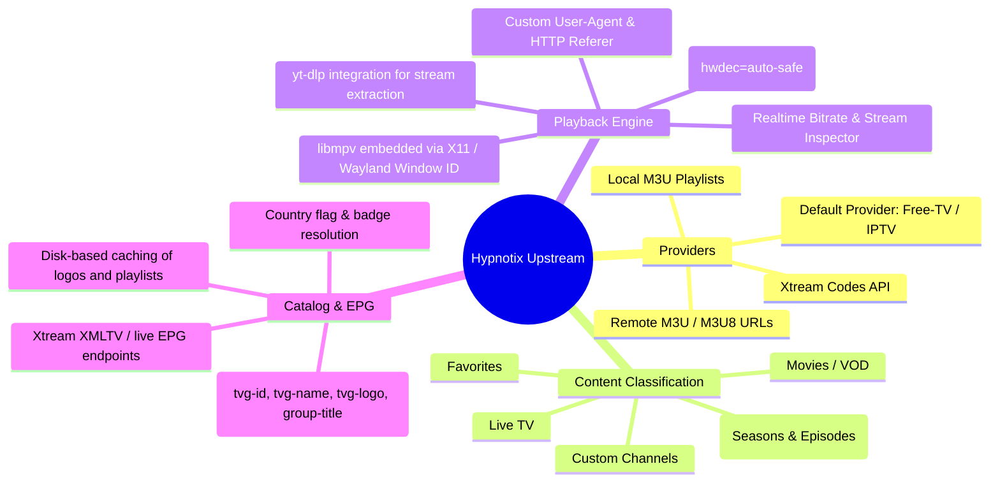
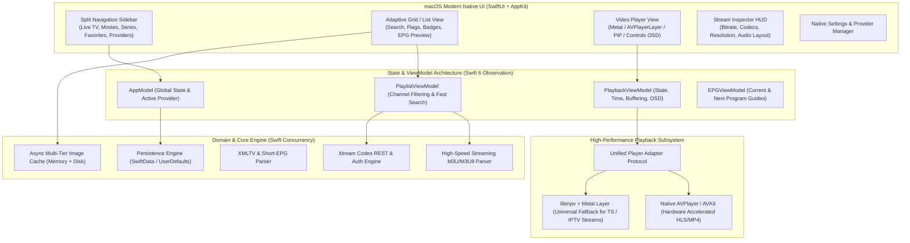

# Hypnotix Upstream Architecture & Feature Deep-Dive

## 1. Executive Summary

[Hypnotix](https://github.com/linuxmint/hypnotix) is Linux Mint's dedicated IPTV streaming desktop application. Built originally using **Python 3**, **GTK 3 (PyGObject)**, **libxapp**, and **libmpv**, it provides a streamlined interface for watching Live TV, Movies (VOD), and TV Series from IPTV playlists and servers.

This document performs an exhaustive architectural and code audit of the upstream Linux Mint codebase to prepare for designing and developing a **modern, shiny, hyper-performant native macOS application** using **Swift, SwiftUI, and native macOS frameworks (AVPlayer / KSPlayer / libmpv-metal / SwiftData)**.

---

## 2. Core Upstream Features & Capabilities

### 2.1 Provider Types & Ingestion
Upstream supports three distinct provider models:

1. **Remote M3U / M3U8 (`url`):**
   - Downloads remote playlist files with streaming HTTP chunks (4MB buffer).
   - Supports custom `User-Agent` and `Referer` headers.
   - Caches playlists to disk (`~/.cache/hypnotix/providers/<slugified_name>`).
   - Periodic background refresh timer (default every 5 minutes / 2 hours).

2. **Local M3U Playlists (`local`):**
   - Directly reads local filesystem `.m3u` or `.m3u8` files.

3. **Xtream Codes API (`xtream`):**
   - Connects to Xtream server endpoints (`player_api.php`) with authentication credentials (`username`, `password`).
   - Fetches Live categories (`get_live_categories`), VOD categories (`get_vod_categories`), and Series categories (`get_series_categories`).
   - Fetches streams (`get_live_streams`, `get_vod_streams`, `get_series`).
   - Lazy-loads episode structures on series selection (`get_series_info`).
   - Parses EPG data (`get_short_epg`, `get_simple_data_table`, `xmltv.php`).
   - Supports server-side adult content filtering flag (`is_adult`).

### 2.2 Content Model & Hierarchies
The upstream data model is organized into three primary categories:
- **Live TV (`TV_GROUP = 0`):** Grouped by country or category tag (e.g. `News`, `Sports`, `Music`).
- **Movies / VOD (`MOVIES_GROUP = 1`):** Grouped by genre or category.
- **TV Series (`SERIES_GROUP = 2`):** Hierarchical structure: `Provider` -> `Group/Genre` -> `Serie` -> `Season` -> `Episode`.

### 2.3 Favorites & Custom Channels
- Favorites are stored in plaintext at `~/.cache/hypnotix/favorites/list` as serialized entries:
  `#EXTINF:-1 tvg-name="Channel" tvg-logo="..." ... :::http://stream-url`
- Users can manually add single custom channels with Name, Stream URL, and Logo URL.

### 2.4 Playback Subsystem (libmpv & yt-dlp)
- Embedding: Uses `libmpv` connected to a GTK DrawingArea's X11 Window ID (`wid`).
- Properties observed in real-time:
  - `video-params` (resolution, aspect ratio, pixel format, gamma, bpp)
  - `video-format` / `audio-codec` (e.g. H.264, HEVC, AAC, MP3, AC3)
  - `audio-params` (channels, 5.1/7.1 surround, sample rate, format)
  - `video-bitrate` & `audio-bitrate` (moving average calculated over last 30 samples)
  - `core-idle` (used to inhibit system sleep/screensaver during playback)
- yt-dlp: Upstream bundles logic to download or update a standalone binary of `yt-dlp` in `~/.cache/hypnotix/yt-dlp/` to allow resolving dynamic YouTube and web video streams.

---

## 3. Upstream Codebase Analysis

| Component | File Path | Responsibilities & Implementation Details |
| :--- | :--- | :--- |
| **Main UI & Controller** | [`usr/lib/hypnotix/hypnotix.py`](file:///_upstream/hypnotix/usr/lib/hypnotix/hypnotix.py) | GTK3 application lifecycle, navigation stack, signal bindings, MPV player instantiation, HUD/OSD overlays, search filtering, sleep inhibition, keyboard shortcuts. |
| **Data Parser & Models** | [`usr/lib/hypnotix/common.py`](file:///_upstream/hypnotix/usr/lib/hypnotix/common.py) | Regex parser for `#EXTINF` and `#EXTM3U`, data classes (`Provider`, `Group`, `Channel`, `Serie`, `Season`), file caching, and background threading helpers. |
| **Xtream Codes Client** | [`usr/lib/hypnotix/xtream.py`](file:///_upstream/hypnotix/usr/lib/hypnotix/xtream.py) | HTTP client for Xtream API endpoints, category/stream JSON parsing, URL construction for live `.ts` and VOD/series container extensions (`.mp4`, `.mkv`), EPG fetching. |
| **libmpv C-Types Wrapper**| [`usr/lib/hypnotix/mpv.py`](file:///_upstream/hypnotix/usr/lib/hypnotix/mpv.py) | Dynamic C-types bridge to `libmpv.so`, event loop listener, property observation, command execution (`play`, `pause`, `stop`, `seek`, `keypress`). |
| **UI Layouts & Styles** | [`usr/share/hypnotix/hypnotix.ui`](file:///_upstream/hypnotix/usr/share/hypnotix/hypnotix.ui) | Glade XML interface defining navigation views, sidebar, headerbar, channel grids, stream info modal, and settings panes. |

---

## 4. Key Limitations & Pain Points in Upstream (To Solve on macOS)

1. **Synchronous/Blocking Operations & Thread Spawning:**
   - Upstream relies on ad-hoc daemon threads and `GLib.idle_add`. Large M3U playlists (e.g. 50,000+ channels) can freeze the UI or take long periods to parse using Python regex.
2. **Fragile Window Embedding (`wid`):**
   - X11/Wayland `wid` embedding is completely incompatible with macOS Quartz / Metal / AppKit compositor.
3. **Logo Caching & Image Pipeline:**
   - Logos are downloaded serially or per-row with basic file writes, causing stutter and high network latency on large channel grids without proper async image caching (e.g. `AsyncImage` / `Kingfisher` style memory + disk cache).
4. **Basic UI & Navigation Flow:**
   - Upstream uses a flat drill-down stack: Landing -> Category -> Channel List.
   - On macOS, a modern three-column / split sidebar design (Sidebar Categories -> Channel Grid/List -> Video Player with PiP & Floating HUD) provides a vastly superior desktop experience.
5. **Lack of Modern macOS Integration:**
   - Upstream has no Picture-in-Picture (PiP), no native AirPlay, no macOS Now Playing / Media Control integration, no Touch Bar / Menu Bar status item, and no native macOS vibrancy/liquid glass styling.

---

## 5. Architectural Blueprint for Hypnotix macOS

---

## 6. Next Steps

- **Phase 2:** Product Requirements Document (PRD) — detailed user stories, performance targets, features.
- **Phase 3:** Software Architecture & Technical Specifications (Player architecture, Swift Concurrency, Stream Pipelines).
- **Phase 4:** Code Design & Best Patterns (Clean MVVM, Protocols, High-speed zero-copy parsers).
- **Phase 5:** User Interface Design (macOS Human Interface Guidelines, Liquid Glass / Vibrancy, Grid/List layouts, Custom OSD, Mini Player, Menu Bar).
- **Phase 6:** Implementation & Testing.
