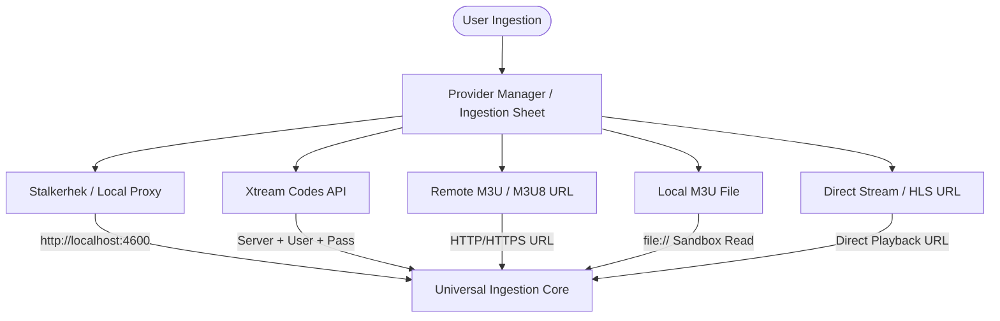
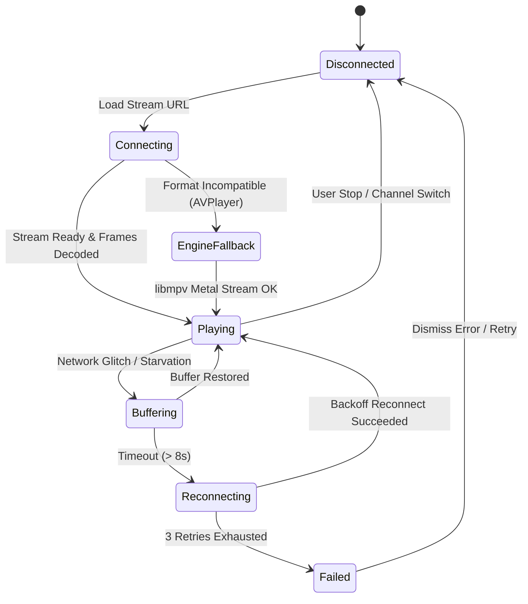

# Product Requirements Document (PRD): Hypnotix for macOS (Hardened)

**Product Name:** Hypnotix for macOS  
**Target Platform:** macOS 14.0+ (Sonoma, Sequoia, and future macOS versions)  
**Architecture:** Universal Binary (Native Apple Silicon ARM64 & Intel x86_64)  
**Primary Tech Stack:** Swift 6, SwiftUI 5/6, AppKit/Metal Integration, AVFoundation, libmpv  

---

## 1. Product Vision & Goals

**Hypnotix for macOS** is an ultra-performant, extensible, native desktop IPTV, VOD, and live streaming client for macOS. It marries the robust format versatility of Linux Mint’s Hypnotix with first-class Apple design language:
- **Universal Provider Engine:** First-class support for **Stalkerhek** local proxies (`http://localhost:4600`), **Xtream Codes** servers (Live TV, VOD, TV Series, EPG), **Remote/Local M3U & M3U8** playlists, and **Direct HLS/MPEG-TS** streams.
- **Hardware-Accelerated Dual Playback Pipeline:** Apple Silicon zero-copy `AVPlayer` for HLS/MP4 with transparent fallback to a Metal-accelerated `libmpv` engine for legacy MPEG-TS, raw transport streams, and exotic codecs.
- **Liquid Glass Aesthetic:** 100% native macOS Human Interface Guidelines (HIG) with dynamic material translucency, micro-animations, keyboard-first navigation, and system-level dark/light mode adaptations.
- **Deep macOS Ecosystem Integration:** Picture-in-Picture (PiP), AirPlay 2, Now Playing control center / keyboard media keys, Menu Bar quick-access player, and power management sleep assertions.

---

## 2. Core Personas & Use Cases

1. **The Stalker & Local Proxy User:** Runs local middleware like `stalkerhek` (`http://localhost:4600` or custom port) and expects zero-latency loopback streaming with instant channel switching.
2. **The Xtream Codes Power Subscriber:** Consumes large Live TV bouquets, multi-season TV series with episode tracking, and on-demand movies with metadata, posters, and cast synopses.
3. **The Free Public IPTV Streamer:** Relies on community playlists (Free-TV, IPTV-org) categorized by country flags and genre badges.
4. **The Multitasking Mac User:** Floats live news or sports in native Picture-in-Picture while working across multiple macOS spaces and displays.

---

## 3. Comprehensive Functional Requirements

### 3.1 Extensible Provider Ingestion Matrix

| Provider Type | Inputs Required | Ingestion Protocol / Endpoints | Output Data Structure |
| :--- | :--- | :--- | :--- |
| **Stalkerhek / Local Proxy** | Server URL + Port (e.g. `http://localhost:4600`), Custom Headers (optional) | HTTP GET loopback; content-type & payload sniffing (`#EXTM3U`, `#EXTINF`, `#EXT-X-`) | Categorized Live TV Channels, direct HLS streams |
| **Xtream Codes** | Server URL, Username, Password | `/player_api.php` endpoints (`get_live_categories`, `get_live_streams`, `get_vod_categories`, `get_vod_streams`, `get_series_categories`, `get_series`, `get_series_info`, `get_short_epg`, `xmltv.php`) | Live TV Bouquets, Movie Catalog, Multi-Season TV Series, EPG Timelines, Account Expiration |
| **Remote M3U / M3U8** | Playlist URL, User-Agent, Referer | HTTP/HTTPS chunked streaming with gzip/deflate | Live Channels, VOD, Country Groups, Custom Logos |
| **Local M3U File** | File path via NSOpenPanel / Drag & Drop | Direct POSIX / `FileManager` streaming read | Instant offline channel catalog |
| **Direct Single Stream** | Channel Name, Stream URL, Optional Logo | Direct URL resolution (HLS, `.m3u8`, `.ts`, `.mp4`, `.mkv`) | 1-click playable channel entry |

### 3.2 Content Catalog & Multi-Season Series Engine
- **Live TV Directory:**
  - Grouping by Country (with ISO-3166 circular flag resolution) and Genre categories (News, Sports, Movies, Music, Kids, Documentaries).
  - Search: Zero-allocation, accent-insensitive (`unidecode`) instantaneous fuzzy search across channel names and TV guide titles.
- **Movies / VOD Catalog:**
  - Grid poster view with resolution badges (`4K`, `1080p`, `HD`), release year, genre tags, and plot overview.
- **TV Series Hub:**
  - Hierarchical drill-down: Series -> Season Selector -> Episode Grid/List.
  - Per-episode metadata: Episode thumbnail, title, duration, air date, and watch progress memory.
- **Favorites & Custom Bouquets:**
  - 1-click star toggle across all views; persistent favorites stored locally.
  - Reorderable favorite channels list with keyboard shortcuts (`Cmd+1` to `Cmd+9`).

### 3.3 Electronic Program Guide (EPG / XMLTV)
- **Live Program Progress Bar:** Displays current show, start/end time, and elapsed percentage on every channel row.
- **Timeline View:** Horizontal/vertical program schedule for the next 24 hours with show descriptions.
- **Short EPG & XMLTV Parser:** Automatic background delta sync; caches guide data with configurable expiration (default: 6 hours).

### 3.4 Hardware-Accelerated Dual Video Playback Engine
- **Intelligent Engine Resolver:**
  - **Primary: Apple AVFoundation (`AVPlayer`):**
    - Hardware-accelerated decoding via Apple Silicon Video Decoder Engines.
    - Native macOS Picture-in-Picture (`AVPictureInPictureController`).
    - Native AirPlay 2 audio/video routing.
    - Lowest battery consumption and zero fan noise.
  - **Secondary / Fallback: Metal-Accelerated `libmpv`:**
    - Seamless fallback for raw MPEG-TS multicast, non-standard audio codecs (AC3, DTS, TrueHD), RTMP, and custom IPTV containers.
    - Rendered directly into a Metal Layer (`CAMetalLayer`) with zero AppKit window tearing.
- **Floating Liquid Glass HUD (OSD):**
  - Controls: Play/Pause, Channel Step Up/Down, Volume with boost slider (up to 200%), Audio Track Selector, Subtitle Selector, Aspect Ratio switcher (`Fit`, `Fill`, `16:9`, `4:3`, `2.35:1`), PiP button, and Fullscreen toggle.
  - Auto-fade timer: Automatically hides after 3.0 seconds of cursor inactivity; wakes instantly on mouse movement.
- **Stream Telemetry & Quality Inspector (`Cmd+I` / `F2`):**
  - Real-time sparkline graph for Video and Audio bitrate.
  - Precise metrics: Resolution (e.g. `3840x2160`), FPS (`59.94 fps`), Video Codec (`HEVC Main 10`), Audio Layout (`Dolby 5.1 / 48kHz`), Dropped Frame Counter, Network Buffer Depth.

### 3.5 macOS Native System Integration
- **Now Playing & Media Keys:** Full integration with `MPNowPlayingInfoCenter` and `MPRemoteCommandCenter` (supports keyboard media keys F7/F8/F9 and AirPods touch controls).
- **Menu Bar Extra:** Status bar icon allowing quick volume adjustment, channel switching from favorites, and mini player preview.
- **Sleep & Screen Saver Prevention:** Active `IOPMAssertion` prevents display sleep only during video playback.
- **Keyboard Shortcuts:**
  - `Space`: Play / Pause
  - `Up` / `Down` Arrow: Next / Previous Channel
  - `Left` / `Right` Arrow: Seek backward / forward 10s (VOD)
  - `Cmd+F` or `F`: Toggle Fullscreen
  - `Cmd+Option+T`: Theater Mode (hides all chrome and sidebars)
  - `Cmd+I` or `F2`: Stream Inspector HUD
  - `Cmd+K`: Shortcuts Help Modal
  - `Cmd+R`: Force refresh active provider

---

## 4. Rigorous Error Handling & Resilience

1. **Network Drop & Auto-Reconnect:** Exponential backoff retry mechanism (1s, 2s, 4s) up to 3 attempts before raising a non-blocking toast warning.
2. **Transparent Engine Fallback:** If `AVPlayer` fails with `AVErrorFormatUnsupported` or codec errors, the player instantly transfers the stream state and timestamp to the Metal `libmpv` engine without interrupting the user.
3. **Corrupted Playlist Isolation:** Corrupted or invalid `#EXTINF` lines in M3U files are skipped and logged without crashing the parser.
4. **Secure Credential Storage:** Xtream passwords and private tokens are encrypted and stored in the **macOS Keychain**.

---

## 5. Non-Functional SLAs & Performance Targets

| Metric | Target SLA | Strategy |
| :--- | :--- | :--- |
| **Channel Zapping Latency** | **< 300 ms** (Local Stalkerhek) / **< 800 ms** (Remote HLS) | Pre-warmed player pipeline & optimized buffer thresholds |
| **M3U Ingestion Speed** | **< 200 ms** for 50,000 channels | SIMD-accelerated zero-copy streaming parser in background Actor |
| **UI Frame Rate** | **Steady 60 / 120 FPS** (ProMotion) | Lazy SwiftUI Stacks, downsampled image cache, off-main-thread parsing |
| **Idle Memory Footprint** | **< 65 MB** | Lightweight Swift data structures and swift memory release |
| **Active 4K Playback RAM** | **< 180 MB** | Direct GPU buffer decoding and bounded ring buffer |
| **Battery Efficiency** | Lowest energy impact score | Native VideoToolbox & AVFoundation hardware pipeline |
