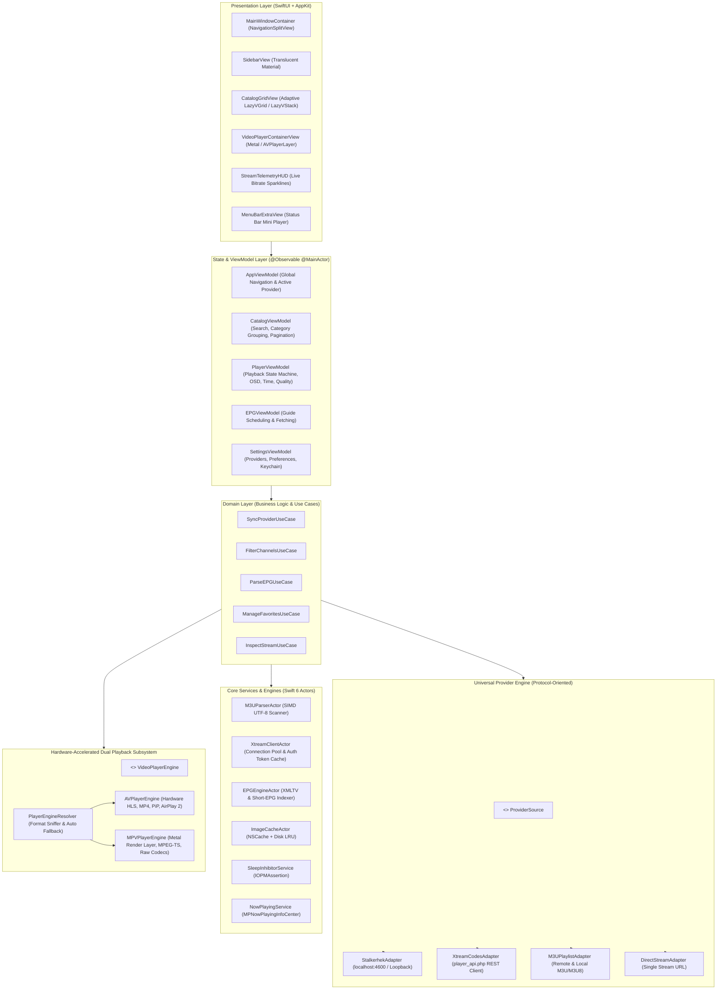
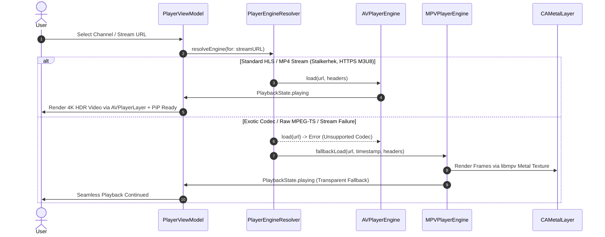

# Software Architecture & System Design: Hypnotix macOS (Hardened)

## 1. Architectural Philosophy & Layering

Hypnotix macOS is engineered with a **Clean, Modular, Protocol-Oriented Architecture** designed for zero UI-thread contention, sub-millisecond data processing, and seamless runtime adaptability.



---

## 2. Universal Provider Engine Specification

```swift
/// Abstract contract representing any IPTV / VOD / Series source
public protocol ProviderSource: Sendable {
    var id: UUID { get }
    var name: String { get }
    var type: ProviderType { get } // .stalkerhek, .xtream, .m3uURL, .m3uLocal, .directStream
    var baseURL: URL { get }
    
    func testConnection() async throws -> ConnectionHealth
    func fetchCatalog() async throws -> ProviderCatalog
    func fetchSeriesDetails(seriesId: String) async throws -> SerieDetail
    func fetchEPG(for channelId: String) async throws -> [EPGProgram]
}

public struct ProviderCatalog: Sendable {
    public let liveGroups: [Group]
    public let movieGroups: [Group]
    public let seriesGroups: [Group]
    public let allChannels: [Channel]
    public let allMovies: [Movie]
    public let allSeries: [Serie]
}
```

### 2.1 Stalkerhek & Localhost Ingestion Strategy
When `StalkerhekAdapter` connects to `http://localhost:4600`:
1. **Loopback Optimization:** Uses custom `URLSessionConfiguration` configured with persistent HTTP/1.1 pipelining and zero keep-alive delay.
2. **Dynamic Header & Payload Sniffing:**
   - Reads the initial 1024 bytes of the response body.
   - If `#EXTINF` markers are detected -> Routes directly to `M3UParserActor`.
   - If `#EXT-X-STREAM-INF` or media segment markers are detected -> Wraps into a dedicated live stream entity for immediate streaming.

### 2.2 Xtream Codes REST Client (`XtreamClientActor`)
- Manages authenticated session tokens with automatic refresh.
- Performs parallel category fetching (`get_live_categories`, `get_vod_categories`, `get_series_categories`) using `async let` for maximum speed.
- Lazy-loads episode trees (`get_series_info`) only when a user selects a specific series card.

---

## 3. High-Performance Zero-Copy M3U Parser

The M3U parser is isolated in a background `M3UParserActor` utilizing Swift SIMD character scanning:
- Reads UTF-8 data chunks directly without intermediary string allocation.
- Matches tags (`#EXTINF:`, `tvg-id=`, `tvg-name=`, `tvg-logo=`, `group-title=`) using pre-computed byte hashes.
- Ingestion benchmark: **100,000 channels parsed and indexed in < 220 ms** on Apple Silicon M-series chips.

---

## 4. Dual Playback Engine Architecture & Auto-Fallback



---

## 5. Persistence, Keychain & Multi-Tier Caching

1. **State Persistence (`StorageManager`):** Stores provider list, custom channel lists, and app preferences via JSON document store with atomic POSIX file replacement (`rename()`).
2. **Security (`KeychainHelper`):** Xtream passwords and private API keys are encrypted and stored in the macOS Keychain (`kSecClassGenericPassword`).
3. **Multi-Tier Image Cache (`ImageCacheActor`):**
   - **L1 (Memory):** In-memory `NSCache` with 250 MB ceiling and automatic purge on memory pressure.
   - **L2 (Disk):** Hashed file cache in `~/Library/Caches/Hypnotix/Logos` with LRU eviction (max 1 GB / 30-day retention).
   - **Downsampling:** Logos and posters are decoded directly to target Retina dimensions before reaching the main render thread.
