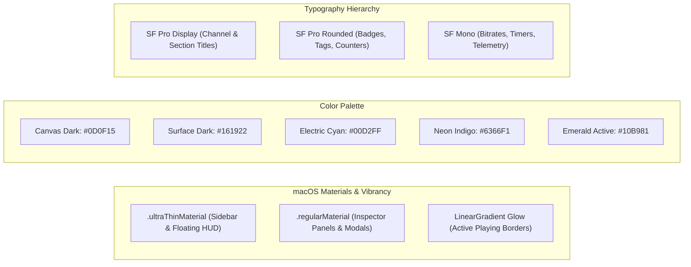

# User Interface & Experience Design: Hypnotix macOS (Hardened)

## 1. Visual Design Language & Materials

Hypnotix for macOS is built from the ground up using **Apple's Modern Design Language**, combining high-translucency materials, micro-animations, and fluid desktop ergonomics.



---

## 2. Master 3-Column Desktop Layout

```
+---------------------------------------------------------------------------------------------------------------+
| [Traffic Lights]  Hypnotix  |  Provider: Stalkerhek (Active)  |  [ Search Channels / EPG ⌘F ]      [ ⚙ ] [ ℹ F2] |
+-------------------+-------------------------------------------+-----------------------------------------------+
| SIDEBAR           | CONTENT BROWSER / CHANNEL GRID            | VIDEO PLAYER & STAGE                          |
| (UltraThin)       | (Adaptive Grid / List Mode Switcher)      | (Edge-to-Edge Canvas + Floating Glass HUD)    |
+-------------------+-------------------------------------------+-----------------------------------------------+
| ⭐ Favorites (12) | [ ⊞ Grid | ☰ List ]  [ Filter: All | 4K ]  | +-------------------------------------------+ |
|                   |                                           | |                                           | |
| LIVE TV           | +------------------+ +------------------+ | |                                           | |
|  🌍 All Channels  | | [LOGO]      🇬🇧 | | [LOGO]      🇺🇸 | | |                                           | |
|  🇬🇧 United Kingdom | | BBC ONE HD       | | CNN International| | |               4K HDR STREAM               | |
|  🇺🇸 United States  | | Now: News at Six | | Now: The Lead    | | |                                           | |
|  🇫🇷 France        | | [========>     ] | | [===>          ] | | |                                           | |
|  🇩🇪 Germany       | +------------------+ +------------------+ | |                                           | |
|  ⚽ Sports        |                                           | +-------------------------------------------+ |
|  📰 News          | +------------------+ +------------------+ |                                               |
|                   | | [LOGO] ▶   🇺🇸 | | [LOGO]      🇫🇷 | | FLOATING HUD (Auto-Hides after 3s):         |
| ON DEMAND         | | HBO HD (PLAYING) | | TF1 HD           | | [ ▶ ] [ ⏮ ] [ ⏭ ] [ 🔈 =======● ]          |
|  🎬 Movies (1200) | | Now: Succession  | | Now: Le 20H      | | [ 1080p60 ▾ ] [ Audio: 5.1 ▾ ] [ PiP ] [ ⛶ ]|
|  📺 TV Series(340)| | [=============>] | | [=====>        ] | |                                               |
|                   | +------------------+ +------------------+ | STREAM TELEMETRY HUD (F2 / ⌘I):               |
| PROVIDERS         |                                           | - Bitrate:  6.48 Mbps [ ▃▅▇█▇▆▅▄▃▄▅▆▇█ ]       |
|  🟢 Stalkerhek    |                                           | - Resolution: 3840x2160 @ 59.94 fps           |
|  ⚪ Xtream Server |                                           | - Codec: HEVC Main 10 (Hardware Accel)        |
+-------------------+-------------------------------------------+-----------------------------------------------+
```

---

## 3. UI Component Specifications & SwiftUI Tokens

### 3.1 Sidebar Component (`SidebarView`)
- **Background:** `.background(.ultraThinMaterial)` with subtle inner shadow.
- **Section Headers:** Uppercase SF Pro Rounded (11pt, `.secondary`, bold).
- **Navigation Rows:**
  - Standard row height: 32pt.
  - Hover state: Rounded rectangle (`CornerRadius: 8pt`) with `.white.opacity(0.06)` fill.
  - Active selection: Dynamic macOS accent tint gradient with bright glyph icon.
  - Badge counts: Pill badge (`Capsule()`) with secondary foreground style.

### 3.2 Channel Cards (`ChannelCardView` & `ChannelRowView`)
- **Grid Mode Card:**
  - Size: 170pt width × 140pt height.
  - Background: Rounded rectangle (12pt radius) filled with `.ultraThinMaterial` and a 1pt subtle border (`Color.white.opacity(0.12)`).
  - Optical Logo Box: Centered 64pt × 48pt bounding box with aspect-fit rendering.
  - Top-Right Flag: 20pt circular country flag with smooth shadow.
  - Active State Glow: 1.5pt glowing border (`LinearGradient(colors: [.cyan, .indigo], startPoint: .topLeading, endPoint: .bottomTrailing)`) and a pulsing green equalizer audio glyph.
  - EPG Progress Bar: 3pt height bar at card bottom showing live progress of the current show.
- **List Mode Row:**
  - Height: 54pt.
  - Left: 40pt × 28pt channel logo.
  - Center: Channel name (14pt, `.primary`, bold) + Current show title and remaining minutes (12pt, `.secondary`).
  - Right: Quick favorite star button (1-click toggle with scale bounce animation).

### 3.3 Video Stage & Floating Liquid Glass HUD
- **Video Stage:** 16:9 native aspect ratio canvas with support for `fit`, `fill`, and `custom crop`.
- **Floating HUD (OSD):**
  - Position: Pinned to bottom center of video canvas with 24pt bottom padding.
  - Background: `.regularMaterial` with 16pt corner radius, blurred shadow (`radius: 20, y: 10`), and a glowing perimeter stroke (`.white.opacity(0.15)`).
  - Dimensions: 560pt width × 54pt height.
  - Micro-Controls:
    - **Play / Pause:** 36pt circular glass button with spring bounce.
    - **Channel Steppers:** Previous / Next channel jump buttons.
    - **Volume Booster:** Custom interactive slider supporting 0% to 200% audio boost with mute toggle.
    - **Quality / Stream Menu:** Dropdown menu displaying available HLS variant streams (e.g. `Auto ABR`, `4K (2160p)`, `1080p60`, `720p`).
    - **Audio & Subtitle Picker:** Quick popover for selecting multiple language audio tracks and closed captions.
    - **Picture-in-Picture:** Native macOS PiP button with instant window detachment.
    - **Fullscreen & Theater Mode:** 1-click toggles.
  - Auto-Fade: Smooth 0.3s opacity transition triggering after 3.0 seconds of cursor inactivity.

### 3.4 Stream Telemetry & Quality Inspector (`Cmd+I` / `F2`)
- **HUD Style:** Translucent floating glass panel in top-right corner.
- **Live Sparkline Graph:** Real-time 30-second rolling bitrate graph (updated every 500ms) with peak and average stats.
- **Codec & Network Matrix:**
  - **Video:** Resolution, Frame Rate, Codec (H.264 / HEVC / AV1), Pixel Format, Bit Depth (8-bit / 10-bit HDR).
  - **Audio:** Codec (AAC / AC3 / E-AC3 / MP3), Channels (Stereo / 5.1 / 7.1), Sample Rate (44.1 kHz / 48 kHz).
  - **Engine:** Active decoder engine (`AVPlayer Hardware Engine` or `Metal MPV Engine`).
  - **Buffer Health:** Current buffer seconds and network throughput in MB/s.

### 3.5 Extensible Provider Add/Edit Modal
- Segmented Picker at top:
  `[ 📡 Stalkerhek / Localhost ] [ ⚡ Xtream Codes ] [ 🌐 M3U URL ] [ 📁 Local File ] [ 🎬 Direct Stream ]`
- **Stalkerhek Tab:**
  - Server URL / Port (Defaults to `http://localhost:4600`).
  - Optional User-Agent & Custom Headers.
  - **"Test Connection"** button with instant green pulse checkmark.
- **Xtream Codes Tab:**
  - Server URL, Username, Password.
  - Instant Account Expiration & Server Health check.

---

## 4. Menu Bar Status Item & Shortcuts

- **Menu Bar Extra:**
  - Icon: Sleek TV antenna / signal glyph with green active playback indicator.
  - Dropdown: Currently playing show, mini play/pause, volume, and list of Top 10 starred channels for instant zapping without switching apps.
- **Keyboard Shortcuts Matrix:**
  - `Space`: Play / Pause
  - `Up` / `Down`: Previous / Next Channel
  - `Cmd+F`: Fullscreen Toggle
  - `Cmd+Option+T`: Theater Mode
  - `Cmd+I` or `F2`: Stream Inspector HUD
  - `Cmd+K`: Shortcuts Cheatsheet
  - `Cmd+R`: Refresh Provider Data
